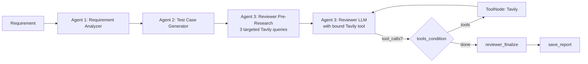

# 🤖 QA Intelligence Suite — Stateful Agentic AI

A *production-shaped* prototype of a **multi-agent QA workflow** built on **LangGraph** that turns a raw user story into a fully reasoned, web-grounded test plan in one click.


> **🚀 One-click deploy** — see [DEPLOYMENT.md](DEPLOYMENT.md) for free deployment on Streamlit Community Cloud, Hugging Face Spaces, Render, Railway, or Fly.io.

> **⚠️ Honest scope note** — this is a *demo-grade* prototype that uses production-style patterns (typed state, tool-binding, structured logging, CI). It is **not** a hardened production system: human review of every generated test suite is expected, and the limitations listed in [Known Limitations & Roadmap](#known-limitations--roadmap) are real.

---

## Table of contents

- [What it does](#what-it-does)
  - [Workflow graph](#workflow-graph)
- [Key features](#key-features)
- [Project structure](#project-structure)
- [Installation](#installation)
  - [Prerequisites](#prerequisites)
  - [Setup](#setup)
- [Run the app](#run-the-app)
  - [Demo script (60 seconds)](#demo-script-60-seconds)
- [How agentic behavior is demonstrated](#how-agentic-behavior-is-demonstrated)
- [Reliability, security & observability](#reliability-security--observability)
- [Configuration reference](#configuration-reference)
- [Per-agent model assignment](#per-agent-model-assignment)
- [Testing & evaluation](#testing--evaluation)
- [Tech stack](#tech-stack)
- [Deployment](#deployment)
- [Known Limitations & Roadmap](#known-limitations--roadmap)
- [License](#license)

---

## What it does

Three specialized agents collaborate over a shared **stateful** LangGraph workflow:

| # | Agent | Persona | Output |
|---|---|---|---|
| 1 | 🧠 **RequirementAnalyzerAgent** | Senior BA / QA Lead | Structured analysis: feature summary, actors, acceptance criteria, preconditions, ambiguities, implicit NFRs |
| 2 | 🧪 **TestCaseGeneratorAgent**   | Senior SDET           | 8–15 Gherkin test cases (positive / negative / boundary / security / accessibility) |
| 3 | 🔍 **TestReviewerAgent**        | QA Manager + autonomous tool-user | Triage matrix (P1–P4, risk, automation feasibility, recommended tool), coverage gaps, risk assessment, execution order — with **(ref: S#) citations** to a pre-researched source ledger |
| — | 💾 **save_report**              | Persistence step      | Writes consolidated Markdown report to `QAReports/qa_report_<timestamp>.md` |

### Workflow graph



---

## Key features

- **Stateful collaboration** — each agent reads earlier agents' output from typed graph state.
- **Autonomous tool use** — Agent 3's LLM has Tavily bound via `bind_tools` and decides on its own whether to issue extra searches mid-reasoning (LangGraph `tools_condition` loop on a private `reviewer_messages` channel).
- **Targeted pre-research** — three category-specific Tavily queries (automation / security / NFR) build a stable **S1..SN source ledger** before the LLM sees the data.
- **Citation discipline** — the Reviewer's prompt enforces strict `(ref: S#)` markers and a post-hoc sanitizer drops any hallucinated S-IDs against the ledger.
- **Streaming progress UX** — the UI uses `graph.stream(stream_mode="updates")` to surface each node's status (`🧠 Analyzing`, `🧪 Generating`, `🔎 Researching`, ...) instead of a blank 30-60s spinner.
- **Bounded tool loop** — a hard `MAX_REVIEWER_TOOL_CALLS=4` budget plus `recursion_limit=12` keeps a misbehaving model from running away with the graph.
- **Prompt-injection defenses** — every untrusted input is wrapped in `<<<DELIMITERS>>>` with explicit "treat as DATA, not instructions" framing across all three agents.
- **Provider-agnostic LLM** — works with **Groq** (Llama 3.x, Gemma 2, gpt-oss) or **Google Gemini** (2.5 Flash / Pro). Adding more is a single class.
- **Per-agent model assignment** — `GraphBuilder(model={"analyzer": fast, "generator": fast, "reviewer": strong})` lets you put a small-fast model on the cheap agents and a strong model only on the Reviewer.
- **Reliability guardrails** — LLM clients ship with `max_retries=3`, `timeout=60`, `temperature=0`; collisions on simultaneous saves are prevented by per-report UUID suffixes.
- **Optional checkpointing** — set `LANGGRAPH_CHECKPOINT_ENABLED=1` to wire `MemorySaver` and resume runs by `thread_id`.
- **Optional password gate** — set `APP_PASSWORD` in Streamlit secrets to lock down a shared deployment.
- **Built-in observability** — structured stdlib logs by default; auto-wires LangSmith tracing when `LANGCHAIN_API_KEY` is set, no code change needed.
- **Graceful degradation** — missing Tavily, missing `bind_tools` support, list-shaped Gemini content — all surfaced as UI banners instead of silent failures.

---

## Project structure

```
app.py                                 # Streamlit entry point
requirements.txt                       # Runtime deps (compatible-release pins)
requirements-dev.txt                   # Adds pytest, ruff, pytest-mock
pytest.ini  /  ruff.toml               # Test + lint configuration
Dockerfile  /  .dockerignore           # Container build (slim Python 3.11)
.python-version  /  runtime.txt        # Python version pinning for Streamlit Cloud / HF Spaces
.streamlit/
  config.toml                          # Theme + server settings
  secrets.toml.example                 # Template (real secrets.toml is gitignored)
.github/
  workflows/ci.yml                     # GitHub Actions: ruff + pytest on every PR
QAReports/                             # Generated reports land here (gitignored)
evals/
  golden_dataset.json                  # 3 reference requirements with expected coverage
  run_evals.py                         # Heuristic scorer (categories / keywords / volume)
tests/
  conftest.py                          # FakeLLM fixture (no API keys needed)
  test_graph_builder.py                # Graph compiles + state schema
  test_citation_sanitizer.py           # `(ref: S#)` validation
  test_reviewer_finalize.py            # String + list-of-parts content shapes
  test_reviewer_budget.py              # Tool-call budget + bind_tools status
  test_save_report.py                  # UUID suffix + report sections
  test_schemas.py                      # Pydantic enum validation
  test_observability.py                # Logging + LangSmith bootstrap
src/
  langgraphAgenticAI/
    main.py                            # Wires UI -> auth gate -> LLM -> Graph -> Display
    schemas.py                         # Pydantic models for structured agent output (scaffold)
    graph/
      graph_builder.py                 # Builds the QA Intelligence Suite LangGraph; optional checkpointer
    llm/
      groq_llm.py                      # ChatGroq with retry/timeout guardrails
      gemini_llm.py                    # ChatGoogleGenerativeAI with retry/timeout guardrails
    nodes/
      requirement_analyzer_node.py     # Agent 1 (delimited inputs)
      test_case_generator_node.py      # Agent 2 (delimited inputs)
      test_reviewer_node.py            # Agent 3 (research + agent + finalize + save_report + citation sanitizer)
    observability/
      setup.py                         # Structured logging + LangSmith auto-wire + token-counter callback
    state/
      state.py                         # TypedDict state schema (incl. private reviewer_messages, tool_binding_status, ...)
    ui/
      ui_config.ini
      ui_config_reader.py
      streamlit_ui/
        load_ui.py                     # Sidebar (LLM/model/keys/Tavily/requirement)
        display_result.py              # Streaming UX + tabs + bind_tools/citation banners
```

---

## Installation

### Prerequisites

- Python **3.11** (pinned via `.python-version` and `runtime.txt`; works on 3.10+ locally)
- A **Groq** or **Gemini** API key
- Optional: **Tavily** API key (enables Agent 3's web grounding + autonomous tool loop)
- Optional: **LangSmith** API key (auto-wires tracing when `LANGCHAIN_API_KEY` is set)

### Setup

```zsh
 git clone <your-fork-url>
```

```zsh
cd agentic-qa-suite
```

```zsh
python -m venv .venv
```

# Windows
```zsh
.venv\Scripts\activate
```

# macOS / Linux
```zsh
source .venv/bin/activate
```

```zsh
pip install -r requirements.txt
```

API keys can be entered directly in the sidebar at runtime — no `.env` is required.

---

## Run the app

```zsh
streamlit run app.py
```

The UI opens at [http://localhost:8501](http://localhost:8501).

### Demo script (60 seconds)

1. Sidebar → **Select LLM**: choose `Groq` (recommended) or `Gemini`.
2. Pick a model (e.g. `llama-3.3-70b-versatile` or `gemini-2.5-flash`) and paste the matching API key.
3. *(Optional)* Paste a Tavily API key to enable Agent 3's web grounding & autonomous tool loop.
4. Paste a user story / requirement into the text area — a ready-to-use **password-reset** example is shown as placeholder text.
5. Click **🚀 Run Multi-Agent QA Workflow**.
6. Streaming status updates appear per agent (`🧠 Agent 1 · Analyzing...` → `🧪 Agent 2 · Generating...` → `🔎 Agent 3 · Researching...` → `🤖 Reasoning` → `📝 Finalizing` → `💾 Saving`); on completion, results render across **5 tabs**:

| Tab | Content |
|---|---|
| 🧠 Agent 1 · Analysis            | Structured requirement breakdown |
| 🧪 Agent 2 · Test Cases          | Gherkin test suite (8–15 scenarios) |
| 🔍 Agent 3 · Review & Triage     | Triage matrix with `(ref: S#)` citations, coverage gaps, risk assessment, execution order |
| 📚 Sources (Audit Trail)         | Interactive table of S1..SN references |
| 📄 Consolidated Report           | Full Markdown report + **download** button |

The same report is also written to `QAReports/qa_report_<timestamp>.md`.

---

## How agentic behavior is demonstrated

| Pattern | Where |
|---|---|
| **Stateful multi-agent collaboration** | Each agent's output is written to a typed [`State`](src/langgraphAgenticAI/state/state.py) field consumed by the next agent. |
| **Pre-fetch + ground** | `reviewer_research` runs 3 deterministic Tavily queries to build a stable source ledger before the LLM reasons. |
| **Bound-tool autonomous loop** | `reviewer_agent` uses `llm.bind_tools([Tavily])`; LangGraph's `tools_condition` (with `messages_key="reviewer_messages"`) routes to a `ToolNode` whenever the model emits `tool_calls`, then loops back. |
| **Channel isolation** | The reviewer's tool-call history lives in a private `reviewer_messages` channel with its own `add_messages` reducer. |
| **Bounded autonomy** | `MAX_REVIEWER_TOOL_CALLS=4` is enforced inside `agent()`; once exhausted, a stop-instruction is injected and the plain LLM produces the final report. |
| **Citation auditability** | Pre-fetched sources have stable IDs `S1..SN`; `_sanitize_citations()` strips any `(ref: S#)` not in the ledger before saving. |
| **Streaming UX** | `display_result.py` consumes `graph.stream(..., stream_mode="updates")` and renders a per-node label as each agent finishes. |
| **Optional checkpointing** | When `LANGGRAPH_CHECKPOINT_ENABLED=1`, the graph is compiled with `MemorySaver` and the UI passes a stable `thread_id` so runs can be resumed. |
| **Graceful degradation** | The graph builder omits the tool loop when Tavily isn't configured; the UI shows a banner whenever `bind_tools` falls back. |
| **Audit trail** | Every cited source is preserved in a Markdown table at the end of the saved report; report filenames are UUID-suffixed to prevent multi-user collisions. |

---

## Configuration reference

All keys can be supplied via `.streamlit/secrets.toml` (recommended for deploys), environment variables, or the sidebar (for `*_API_KEY` only).

| Key | Required? | Effect |
|---|---|---|
| `GROQ_API_KEY`                  | One of these two | Picks Groq as LLM provider |
| `GEMINI_API_KEY`                | One of these two | Picks Gemini as LLM provider |
| `TAVILY_API_KEY`                | Optional | Enables Agent 3's source ledger + autonomous tool loop |
| `LANGCHAIN_API_KEY`             | Optional | Auto-enables LangSmith tracing |
| `LANGCHAIN_PROJECT`             | Optional | Defaults to `qa-intelligence-suite` |
| `LANGGRAPH_CHECKPOINT_ENABLED`  | Optional | `1`/`true` to wire in-memory checkpointing |
| `APP_PASSWORD`                  | Optional | Locks the deployed app behind a password |
| `LOG_LEVEL`                     | Optional | Defaults to `INFO`; set `DEBUG` for verbose logs |

See [`.streamlit/secrets.toml.example`](.streamlit/secrets.toml.example) for a copy-paste template.

---

## Per-agent model assignment

For cost or latency tuning you can pass a dict of LLM clients to `GraphBuilder` instead of a single model:

```python
from langchain_groq import ChatGroq
from src.langgraphAgenticAI.graph.graph_builder import GraphBuilder

fast = ChatGroq(model="llama-3.1-8b-instant",   temperature=0, max_retries=3, timeout=60)
strong = ChatGroq(model="llama-3.3-70b-versatile", temperature=0, max_retries=3, timeout=60)

graph = GraphBuilder(
    model={"analyzer": fast, "generator": fast, "reviewer": strong}
).setup_graph(GraphBuilder.USECASE)
```

Missing keys fall back to `model["default"]` (or the first value in the dict). Passing a single LLM remains fully back-compatible.

---

## Testing & evaluation

```zsh
pip install -r requirements-dev.txt
```

### Unit tests (no API keys needed; uses FakeLLM fixture)
```zsh
pytest -ra
```

```zsh
ruff check src tests evals
```

### End-to-end heuristic eval against the golden dataset (needs a real LLM key)
```zsh
python -m evals.run_evals
```

* **Unit tests** cover the graph builder, citation sanitizer, reviewer finalize (string + Gemini list-of-parts shapes), tool-call budget, save-report UUID/sections, Pydantic schema enums, and the observability bootstrap.
* **CI**: every push / PR runs ruff + pytest on Python 3.11 via [`.github/workflows/ci.yml`](.github/workflows/ci.yml).
* **Eval harness**: [`evals/run_evals.py`](evals/run_evals.py) runs each requirement in [`evals/golden_dataset.json`](evals/golden_dataset.json) through the graph and scores it on must-have categories, must-have keywords, and minimum test-case count. Returns non-zero when the average drops below 60% — ready to drop into CI as a regression gate.

---

## Tech stack

| Layer | Tech |
|---|---|
| Orchestration  | LangGraph (`StateGraph`, `ToolNode`, `tools_condition`, `MemorySaver`) |
| LLM clients    | `langchain_groq`, `langchain-google-genai` |
| Tools          | `langchain_community.tools.tavily_search.TavilySearchResults`, `tavily-python` |
| Schemas        | Pydantic v2 (scaffolded for `with_structured_output` migration) |
| UI             | Streamlit (sidebar config + 5-tab streaming results view) |
| Observability  | stdlib `logging` + LangSmith (auto-wired via env) |
| Testing & lint | `pytest`, `pytest-mock`, `ruff` |
| CI/CD          | GitHub Actions → Streamlit Cloud / HF Spaces / Render / Railway / Fly.io |
| Container      | `python:3.11-slim` Docker base |
| Language       | Python 3.11 |

---

## Deployment

This app deploys for **free** to multiple platforms from the same repo. Full step-by-step guide in **[DEPLOYMENT.md](DEPLOYMENT.md)**.

| Platform | Free tier | Best for |
|---|---|---|
| Streamlit Community Cloud | Unlimited public apps | Fastest path, recommended |
| Hugging Face Spaces       | 16 GB RAM (Docker SDK)  | ML-native showcase |
| Render / Railway / Fly.io | Container-based         | Custom domain / scaling |

---

## License

MIT

---

